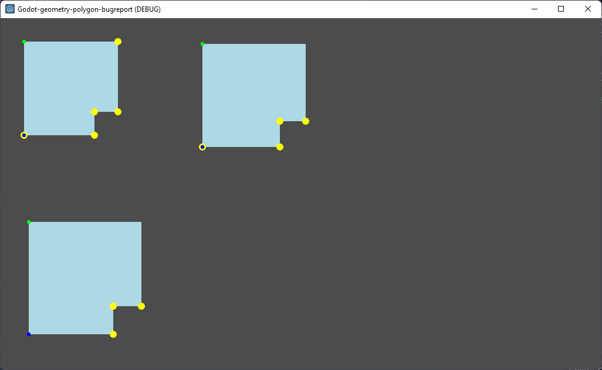

# Surprising behaviour

Surprising behaviour from `Geometry.is_point_in_polygon`.

Check if each point in the polygon is "in" the polygon, using [Geometry.is_point_in_polygon](https://docs.godotengine.org/en/stable/classes/class_geometry.html#class-geometry-method-is-point-in-polygon), which states

> Returns true if point is inside polygon **or if it's located exactly on polygon's boundary**, otherwise returns false.

(**bold** emphasis mine)

Here we show basically the same polygon, with the yellow dots indicating the points for which the above function returns `false`, with each polygon a slightly larger version of the original.

(green dot is the first vertex, and blue dot is the last vertex)

Precision error?

# What I expect

Each vertex in the polygon should be in/on the polygon, so we should see yellow dots on every corner.

